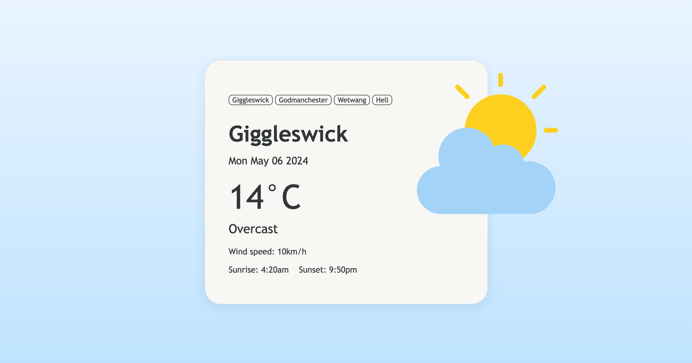
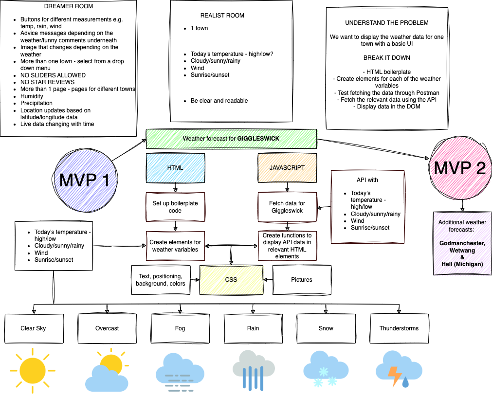

<!-- PROJECT LOGO -->

  

  <h3 align="center">Weather App</h3>

  

    A weather app made with Albert Szupszynski and Ravi Kataria for the School of Code Week 3 Hackathon.
    

   
<a href="https://erinshien.github.io/weatherapp/">View Demo</a>

<!-- TABLE OF CONTENTS -->
   

  
Table of Contents

  <ol>
    <li>
      <a href="#about-the-project">About The Project</a>
      <ul>
        <li><a href="#introduction">Introduction</a></li>
        <li><a href="#built-with">Built With</a></li>
          <li><a href="#our-process">Our Process</a></li>
      </ul>
    </li>
    <li><a href="#roadmap">Roadmap</a></li>
    <li><a href="#acknowledgments">Acknowledgments</a></li>
  </ol>

<!-- ABOUT THE PROJECT -->
## About The Project

### Introduction

Our goal was to build a simple application leveraging a third-party weather API that displays weather data for the user to see in the browser.

### Built With

* 
* 
* 

(<a href="#readme-top">back to top</a>)

### Our Process

We planned out our process in a flow diagram, and then translated this into tickets that we took turns to fulfill.

(<a href="#readme-top">back to top</a>)

<!-- ROADMAP -->
## Roadmap

- [x] Set Up
    - [x] Boiler plate code
    - [x] Create HTML elements for weather data
- [x] Fetch the data for 1 day of weather from 1 location
    - [x] Generate url by selecting relevant data on API website
    - [x] Assign url to variable
    - [x] Write async/await fetch function
- [x] Create functions to locate the relevant data and display in the DOM
    - [x] Locate element on the DOM
    - [x] Repeat for Temperature
    - [x] Repeat for Weather Type
    - [x] Repeat for Wind Speed
    - [x] Repeat for Sunrise/Sunset
    - [x] Add date
- [x] Replace text.content with matching data from API
- [x] Write Logic
    - [x] Write if statement that returns phrases based on weather code
    - [x] Convert sunrise/sunset strings into only the time
- [x] Styling
    - [x] Select background
    - [x] Create main container
    - [x] Style text - font, sizes, spacing
    - [x] Position text elements within container
- [ ] Stretch Goals
    - [x] Image that changes based on data
    - [x] More than 1 location
    - [ ] Buttons to show the data
    - [ ] Get location from lat/long data
    - [ ] Messages based on data (advice/funny comments)

(<a href="#readme-top">back to top</a>)

<!-- ACKNOWLEDGMENTS -->
## Acknowledgments

* [Icons by iconixar](https://www.freepik.com/author/user8839173/icons/iconixar-flat_822?t=f&query=weather)
* [Open Meteo API](https://open-meteo.com/)

(<a href="#readme-top">back to top</a>)

